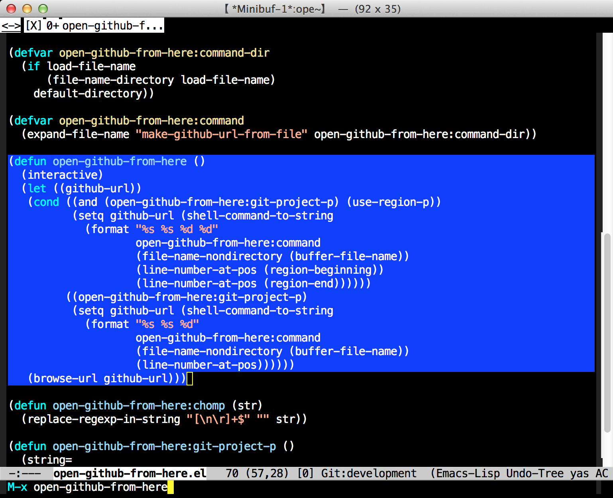
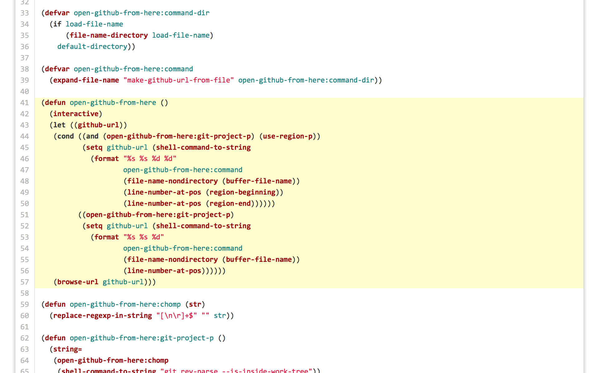

# open-github-from-here.el

## Introduction
open-github-from-here is interface to open github file url from emacs, such as https://github.com/shibayu36/emacs-open-github-from-here/blob/development/open-github-from-here.el#L41..L57

## Screenshot

Select region as following,

And `M-x open-github-from-here`

Then open github file URL

## Requirements

* system perl
* git

## Installation

You can install `open-github-from-here.el` from el-get.

Add following to your el-get-sources setting and execute `M-x el-get-install open-github-from-here`

(setq el-get-sources
      '(
        (:name open-github-from-here
               :type github
               :description "open github from here"
               :url "https://github.com/shibayu36/emacs-open-github-from-here")
        ))

## Commands

`open-github-from-here.el` provides following commands.

### `open-github-from-here`

open github file url from select region.